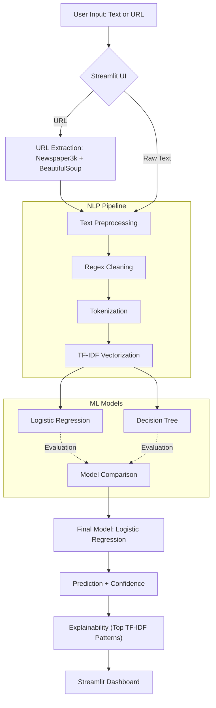

# 📰 AI News Credibility Classification (Milestone-1 Mid-Sem Submission)

---

## 📌 Problem Understanding

The rise of digital media has significantly increased the spread of misinformation and fake news. Readers often lack tools to quickly assess the reliability of news content.

This project introduces an **AI-powered News Credibility Classification System** that evaluates news articles (raw text or URLs) using classical NLP and Machine Learning techniques to identify linguistic patterns associated with misinformation.

---

## 🎯 Objective

The system classifies news articles into:

- ✅ **High Credibility (Real News)**
- ⚠️ **Low Credibility (Potential Misinformation)**

Key design goals:
- Interpretability
- Fast inference
- No deep learning / LLMs
- Robust evaluation
- Explainable predictions

---

## 🏗️ System Architecture



## 📁 Project Structure
```text
news-credibility/
│
├── data/
│   ├── Fake.csv
│   └── True.csv
│
├── src/
│   ├── preprocess.py
│   ├── train.py
│   └── predict.py
│
├── app.py
├── best_model.pkl
├── metrics.json
├── requirements.txt
└── README.md
```

## ⚙️ Pipeline Explanation

### 🔹 Preprocessing (src/preprocess.py)
* Merge Fake & Real datasets
* Drop missing values
* Combine title + text
* Regex cleaning (URLs, punctuation, symbols)
* Duplicate removal after cleaning
* Filter short articles
* Shuffle dataset

### 🔹 Feature Engineering
* TF-IDF vectorization (max_features=5000)
* Stopword removal via TF-IDF
* Sparse semantic representation

### 🔹 Model Training (src/train.py)
Two models were trained:

| Model | Purpose |
|---|---|
| Logistic Regression | Stable baseline with L2 regularization |
| Decision Tree | Non-linear baseline with depth constraints |

Evaluation metrics: Accuracy, Precision, Recall, F1 Score
👉 Decision Tree achieved slightly higher F1 but showed signs of overfitting.
👉 Logistic Regression was selected for deployment due to better generalization.

Artifacts generated:
* `best_model.pkl`
* `metrics.json`

### 🔹 Prediction & Explainability (src/predict.py)
**Features:**
* Pipeline loading
* URL scraping with fallback
* Text cleaning consistency
* Confidence scoring
* TF-IDF pattern extraction

**Explainability:**
* Top semantic terms influencing prediction

---

## 🎨 Streamlit UI (app.py)

A premium interactive dashboard including:

### ✨ UI Features
* Glassmorphism design
* Particle background animation
* SVG iconography (no emoji)
* Animated confidence bar
* Radar chart credibility visualization
* Semantic pattern pill tags
* Sidebar model telemetry
* Smooth loading animation
* Dark SaaS-style theme

### 🔎 Functional Features
* Raw text analysis
* URL analysis
* Explainable prediction signals
* Confidence scoring
* Real-time feedback

---

## 📊 Evaluation Summary

| Model | F1 Score |
|---|---|
| Logistic Regression | ~0.97 |
| Decision Tree | ~0.99 |

**Final Deployment Model: Logistic Regression**
Reason: Better generalization and robustness against TF-IDF overfitting.

---

## 🚀 Setup Instructions

### 1️⃣ Install Dependencies
```bash
pip install -r requirements.txt
```

### 2️⃣ Add Dataset
Place your datasets in the data folder:
* `data/Fake.csv`
* `data/True.csv`

### 3️⃣ Train Model
```bash
python -m src.train
```
This generates `best_model.pkl` and `metrics.json`.

### 4️⃣ Run Web App
```bash
streamlit run app.py
```

---

## ☁️ Deployment (Streamlit Cloud)
1. Push project to GitHub
2. Go to [https://share.streamlit.io](https://share.streamlit.io)
3. Select repository
4. Choose `app.py`
5. Deploy

---

## 🧰 Tech Stack
**NLP & ML:** Python, Scikit-learn, TF-IDF, Logistic Regression, Decision Tree
**Scraping:** Newspaper3k, BeautifulSoup, Requests
**UI & Visualization:** Streamlit, Matplotlib (Radar chart)
**Utilities:** Pandas, NumPy, Joblib

*❌ No Deep Learning*
*❌ No Transformers*
*❌ No LLM APIs*
